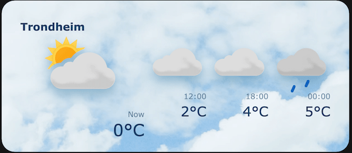

# Weather Widget

First of all - thank you for taking the time to complete this task!
You are completely free to chose any libraries and/or frameworks of preference (if any) to solve this task. But we would like you to emphasize keeping your solution light weight without unnecessary dependencies. In case you choose to use any frameworks and/or libraries, please consider why you chose them and how they contribute. 

## About this repo

This repo contains:
- An index.html file
- An assets folder with svg icons
- This readme file
- 
You are encouraged to fork this repo or create a new one if that is more practical.

## Instructions

We would like you to create a website containing two things:
-  A search input field where the user can search for a location
-  weather widget displaying the weather forecast for the selected location. The widget should look something like this:

The widget displays the current weather for a location, and in addition it displays the forecast for 3 out of 4 specific times:
00:00, 06:00, 12:00 and 18:00. 
If the current time is 13:00, it displays the time for 18:00, 00:00 and 06:00,  
if the current time is 05:00, it displays the time for 06:00, 12:00 and 18:00, etc…

### Location data - getting latitude and longitude for a location
The index.html file already contains an input field that will trigger a fetch request on input events.
The fetch request returns an array of location objects based on your search query.
The location objects contains info about the location, such as latitude and longitude. 

Feel free to use the index.html as a starting point for your solution. If you'd rather start completely fresh, please go ahead!

### Weather forecast data

The data for populating the weather forecast can be retrieved at this endpoint:
https://api.met.no/weatherapi/locationforecast/2.0/complete?lat=63.4468&lon=10.4219

The data you'll get back from the endpoint includes a timeseries array for the weather forecast at the chosen latitude/longitude. 
Each object in the timeseries array contains forecast for a specific date and time.

Some relevant properties to look for in the objects are:
- object.time
- object.data.instant.details.air_temperature
- object.data.next_1_hours.summary.symbol_code   

### Layout
To keep things simple, the widget can have a fixed width and height. But if you want to create a responsive layout and show us some creativity, please go ahead!

### Weather forecast icons
The weather forecast icons you’ll use can be found in the assets folder. 
Their filename is exactly like the values you’ll get in the  object.data.next_1_hours.summary.symbol_code

### Other
Testing is important, as well as making judgments about what makes sense to test. 
Tests are not required for this assignment, but feel free to write some.

